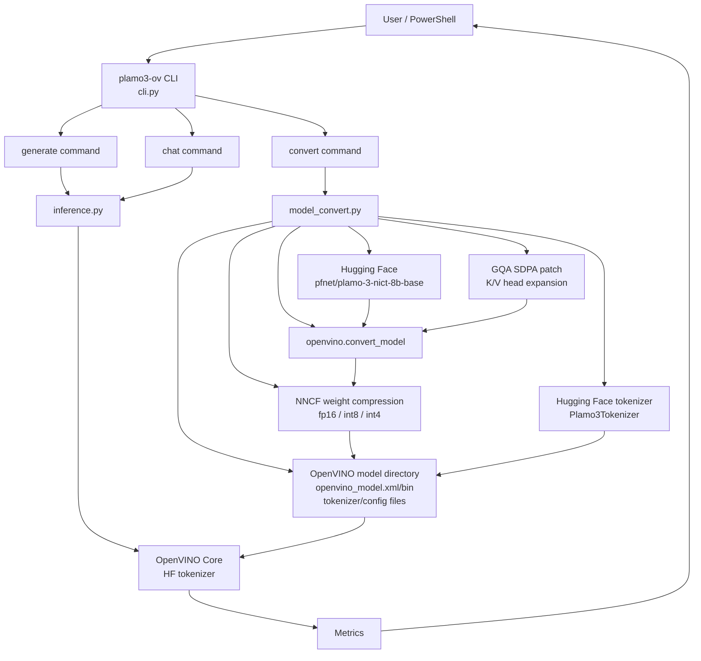

# plamo3_benchmark

`pfnet/plamo-3-nict-8b-base` を OpenVINO で動かすための
Python CLI です。Hugging Face 上の PLaMo 3 NICT 8B Base を OpenVINO IR に変換し、
テキスト生成や簡易チャットを実行できます。

## できること

- Hugging Face の PLaMo 3 NICT 8B Base を OpenVINO IR へ変換
- OpenVINO GenAI 互換のステートフル KV cache IR(既定)での逐次推論
- PLaMo 3 トークナイザの OpenVINO IR 変換(Unigram 再構築)
- `fp32` / `fp16` / `int8` / `int4` の weight format を指定
- CPU / GPU / NPU / AUTO などの OpenVINO device string で推論
- 位置引数、ファイル、標準入力からプロンプトを投入
- CLI 上での対話チャット
- 生成ごとの FTTT、生成トークン数、合計時間、tokens/sec の表示

## 前提

- Python 3.10 以上
- `uv`
- Hugging Face アカウント
- `pfnet/plamo-3-nict-8b-base` へのアクセス権

PLaMo 3 NICT 8B Base は gated repo です。先にモデルページでアクセス申請または
ライセンス同意を済ませてください。

https://huggingface.co/pfnet/plamo-3-nict-8b-base

このモデルは Hugging Face の custom code を使うため、CLI は既定で
`trust_remote_code=True` を指定します。利用前にモデルライセンスとコードの内容を
確認してください。

## アーキテクチャ



## セットアップ

```powershell
uv sync
```

モデルファイルのダウンロードには Hugging Face Xet Storage を使うため、依存に
`hf-xet` を含めています。

Hugging Face 認証が必要な場合は、どちらかの方法でログインします。

```powershell
uv run huggingface-cli login
```

```powershell
$env:HF_TOKEN="<your-token>"
```

## クイックスタート

まず OpenVINO 形式へ変換します。

```powershell
uv run plamo3-ov convert --output-dir ov-plamo3 --weight-format fp16
```

NPU で動かす場合は、変換時に NPU 向けの固定 shape IR と int32 token 入力に寄せます。

```powershell
uv run plamo3-ov convert --output-dir ov-plamo3-npu-int4 --target-device NPU --weight-format int4 --max-seq-len 512 --force
uv run plamo3-ov generate "これからの人工知能技術は" --model ov-plamo3-npu-int4 --device NPU --max-new-tokens 128
```

変換したモデルで生成します。

```powershell
uv run plamo3-ov generate "これからの人工知能技術は" --model ov-plamo3 --max-new-tokens 128
```

チャットを始める場合:

```powershell
uv run plamo3-ov chat --model ov-plamo3 --device CPU --max-new-tokens 128
```

## OpenVINO 形式への変換

この CLI は `optimum-cli` を使わず、`openvino.convert_model` で
OpenVINO 用のモデルディレクトリを作ります。推論は OpenVINO Core と
Hugging Face tokenizer を組み合わせて実行します。

```powershell
uv run plamo3-ov convert --output-dir ov-plamo3 --weight-format fp16
```

主なオプション:

- `--model`: 変換元モデル。既定は `pfnet/plamo-3-nict-8b-base`
- `--output-dir`: 変換後のモデルディレクトリ
- `--weight-format`: `fp32`、`fp16`、`int8`、`int4`
- `--max-seq-len`: `--no-kv-cache` 時に使う固定シーケンス長(既定 512)。KV cache 付き変換では動的 shape なので不要
- `--target-device`: 変換先デバイスの目安。`NPU` を指定すると固定 shape と int32 入力で変換
- `--kv-cache` / `--no-kv-cache`: 既定は有効で、OpenVINO GenAI 互換のステートフル KV cache IR(`ReadValue`/`Assign` 内部状態 + `beam_idx`)を作ります。1 トークンごとに全文を再計算しないため、`--no-kv-cache` の full-context IR より桁違いに高速です。NPU 向けは自動的に `--no-kv-cache` になります
- `--force`: 既存の `openvino_model.xml` があっても再変換
- `--local-files-only`: Hugging Face にアクセスせず、ローカル cache またはローカルモデルディレクトリだけを使う
- `--trust-remote-code` / `--no-trust-remote-code`: custom code の許可

`int8` は通常 NNCF の `INT8_ASYM`、`int4` は通常 NNCF の `INT4_ASYM` weight compression を
OpenVINO IR に適用します。`--target-device NPU` の場合は ASYM を使わず、`int8` は
`INT8_SYM`、`int4` は `INT4_SYM`、`ratio=1.0`、`group_size=-1` で圧縮します。

```powershell
uv run plamo3-ov convert --output-dir ov-plamo3-int8 --weight-format int8
uv run plamo3-ov convert --output-dir ov-plamo3-int4 --weight-format int4
```

`--no-kv-cache` で `--max-seq-len` を省略した場合は 512 を使います。`--no-kv-cache` の
full-context IR はトレース時のシーケンス長に固定され、1 トークンごとに全文を再計算するため
低速です。通常は既定のステートフル KV cache 変換を使ってください。

`--target-device NPU` を指定した場合、NPU plugin が受けやすいように変換後の
`input_ids` / `attention_mask` は int32、shape は `[1, --max-seq-len]` に固定されます。
`--max-seq-len` を省略した場合は 512 を使います。`--weight-format fp32` を指定しても
NPU 向けには FP16 保存へ切り替えます。

NPU 用 int4 を作る場合:

```powershell
uv run plamo3-ov convert --output-dir ov-plamo3-npu-int4 --target-device NPU --weight-format int4 --max-seq-len 512 --force
```

Hugging Face への HEAD request が接続リセットになる環境で、モデルがすでに cache 済みの場合は
`--local-files-only` を付けるとネットワーク確認を避けられます。

```powershell
uv run plamo3-ov convert --output-dir ov-plamo3-npu-int4 --target-device NPU --weight-format int4 --max-seq-len 512 --force --local-files-only
```

既存ディレクトリに `openvino_model.xml` がある場合、`convert` はモデル本体を再利用し、
tokenizer と config を補完します。既存の別形式 IR を `int8` または `int4` に置き換える場合は、
Windows のファイルロックを避けるため `--force` を付けるか、別の出力ディレクトリを
使ってください。

```powershell
uv run plamo3-ov convert --output-dir ov-plamo3 --weight-format int8 --force
uv run plamo3-ov convert --output-dir ov-plamo3 --weight-format int4 --force
```

## テキスト生成

```powershell
uv run plamo3-ov generate "これからの人工知能技術は" --model ov-plamo3
```

`generate` は PLaMo 3 Base モデルの素の continuation を実行します。質問応答や会話として
使う場合は、下の `chat` コマンドを使うか、プロンプト内に `System:` / `User:` /
`Assistant:` のような会話形式を明示してください。

デバイスは `--device` で指定できます。OpenVINO の device string をそのまま渡します。

```powershell
uv run plamo3-ov generate "これからの人工知能技術は" --model ov-plamo3 --device CPU
uv run plamo3-ov generate "これからの人工知能技術は" --model ov-plamo3-int8 --device GPU
uv run plamo3-ov generate "これからの人工知能技術は" --model ov-plamo3-int4 --device AUTO:GPU,CPU
uv run plamo3-ov generate "これからの人工知能技術は" --model ov-plamo3-npu-int4 --device NPU
```

ファイルまたは標準入力からプロンプトを渡すこともできます。

```powershell
uv run plamo3-ov generate --prompt-file prompt.txt --model ov-plamo3
Get-Content prompt.txt | uv run plamo3-ov generate --stdin --model ov-plamo3
```

生成オプション:

- `--max-new-tokens 128`
- `--temperature 0.8`
- `--top-p 0.95`
- `--top-k 50`
- `--stream` / `--no-stream`
- `--skip-prompt` / `--no-skip-prompt`

OpenVINO GenAI 経路は `gemma4_demo.py` と同じく greedy decoding で生成します。
`--temperature` / `--top-p` / `--top-k` / `--stream` は direct fallback でのみ使います。

## チャット

CLI 上で対話するには `chat` を使います。起動時にモデルを一度だけロードし、同じ
セッション内の各ターンで再利用します。

```powershell
uv run plamo3-ov chat --model ov-plamo3-int4 --device GPU --max-new-tokens 128
```

`pfnet/plamo-3-nict-8b-base` のような Base モデルでは、OpenVINO GenAI のネイティブ
chat template ではなく、CLI 側で `System:` / `User:` / `Assistant:` 形式のプロンプトを
組み立てます。応答が次の `User:` まで続きやすいため、chat では会話区切りの stop string も
指定します。

チャット中のコマンド:

- `/exit` または `/quit`: 終了
- `/reset`: 会話履歴をクリア

システムプロンプトを付ける場合:

```powershell
uv run plamo3-ov chat --model ov-plamo3 --system "日本語で簡潔に答えてください。"
```

## 変換ルートの注意点

PLaMo 3 は Hugging Face の custom code モデルです。このリポジトリの変換ルートは
実験的です。

この CLI は `optimum-cli` を使わず、`torch.export`(動的 shape)と OpenVINO 本体の
`openvino.convert_model` で PLaMo 3 を変換し、`apply_make_stateful_transformation` で
KV cache を内部状態化した GenAI 互換 IR を作ります。

PLaMo 3 の GQA attention は、変換時だけ K/V heads を明示的に展開して OpenVINO の
`ScaledDotProductAttention` に渡します。sliding window attention はキャッシュの切り詰めでは
なく位置ベースのマスクで実現しているため、KV cache は最大 `max_position_embeddings`
(4096 トークン)まで成長します。

PLaMo 3 のトークナイザ(custom code の Unigram 実装)は `openvino_tokenizers` が直接
変換できないため、語彙 `tokenizer.jsonl` から等価な Hugging Face fast Unigram トークナイザを
再構築して IR 化します。既知の差分は 2 つだけです:
`break_around_repeated_chars_threshold`(連続同一文字での分割)は再現していません
(デコード結果は同一)。また detokenizer はデコード結果が 2 個以上の空白で始まる場合に
先頭の空白を 1 つ落とします。

推論では OpenVINO GenAI の `LLMPipeline` を優先して使います。GenAI 互換ではない IR の
場合だけ、OpenVINO Core と Hugging Face tokenizer を組み合わせた direct fallback で
生成します(ステートフル IR は逐次推論、旧 full-context IR は固定長の範囲内で生成)。

## 出力されるメトリクス

各生成後、stderr に次の形式でメトリクスを表示します。

```text
[metrics] model_load: 12.326s | time_to_first_token: 0.123s | output_tokens: 128 | tokens/sec: 28.02
```

- `model_load`: GenAI pipeline のロード時間
- `time_to_first_token`: first token time
- `output_tokens`: 生成トークン数
- `tokens/sec`: first token 以降の 1 秒あたりの生成トークン数
