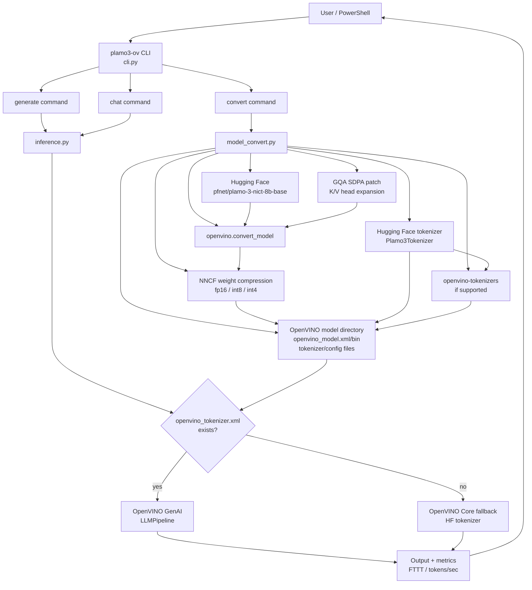

# plamo3_benchmark

`pfnet/plamo-3-nict-8b-base` を OpenVINO GenAI で推論するための Python CLI です。

PLaMo 3 NICT 8B Base は Hugging Face 上で `trust_remote_code=True` が必要な
base model です。モデルライセンスを確認し、必要に応じて Hugging Face にログインしてから使ってください。
このモデルは gated repo なので、先に https://huggingface.co/pfnet/plamo-3-nict-8b-base
でアクセス申請またはライセンス同意を済ませます。

## アーキテクチャ



## セットアップ

```powershell
uv sync
```

モデルファイルのダウンロードには Hugging Face Xet Storage を使うため、依存に `hf-xet` を含めています。

Hugging Face 認証が必要な場合:

```powershell
uv run huggingface-cli login
```

または PowerShell でトークンを渡します。

```powershell
$env:HF_TOKEN="<your-token>"
```

## OpenVINO 形式へ変換

この CLI は `optimum-intel` を使わず、`openvino.convert_model` と `openvino-tokenizers` で
OpenVINO GenAI が読むディレクトリを作ります。

PLaMo 3 は Hugging Face の custom code モデルなので、この変換ルートは実験的です。
OpenVINO GenAI の公式ドキュメントでは、Hugging Face LLM の一般的なIR変換には
`optimum-cli export openvino` が案内されていますが、PLaMo 3 はその exporter でも未対応です。
PLaMo 3 の GQA attention は、変換時だけ K/V heads を明示的に展開して OpenVINO の
`ScaledDotProductAttention` に渡します。
PLaMo 3 tokenizer は custom Python tokenizer のため `openvino-tokenizers` では変換できません。
その場合は Hugging Face tokenizer を保存し、推論時に OpenVINO Core + HF tokenizer の fallback
generator を使います。

```powershell
uv run plamo3-ov convert --output-dir ov-plamo3 --weight-format fp16 --max-seq-len 512
```

`--weight-format` は `fp16`、`fp32`、`int8`、`int4` を指定できます。`int8` は NNCF の
`INT8_ASYM`、`int4` は NNCF の `INT4_ASYM` weight compression を OpenVINO IR に適用します。
既に `openvino_model.xml` がある場合、`convert` は本体IRを再利用して tokenizer/config だけ補完します。
`--weight-format int8` または `--weight-format int4` で既存の別形式IRを置き換える場合は、Windowsのファイルロックを避けるため
`--force` を付けてPyTorchから作り直すか、別の出力ディレクトリを使います。

```powershell
uv run plamo3-ov convert --output-dir ov-plamo3-int8 --weight-format int8 --max-seq-len 512
uv run plamo3-ov convert --output-dir ov-plamo3-int4 --weight-format int4 --max-seq-len 512
# 既存ディレクトリへ作り直す場合
uv run plamo3-ov convert --output-dir ov-plamo3 --weight-format int8 --max-seq-len 512 --force
uv run plamo3-ov convert --output-dir ov-plamo3 --weight-format int4 --max-seq-len 512 --force
```

## 推論

```powershell
uv run plamo3-ov generate "これからの人工知能技術は" --model ov-plamo3 --max-new-tokens 128
```

推論デバイスは `--device` で指定できます。OpenVINO の device string をそのまま渡せます。

```powershell
uv run plamo3-ov generate "これからの人工知能技術は" --model ov-plamo3 --device CPU
uv run plamo3-ov generate "これからの人工知能技術は" --model ov-plamo3-int8 --device GPU
uv run plamo3-ov generate "これからの人工知能技術は" --model ov-plamo3-int8 --device AUTO:GPU,CPU
```

ファイルや標準入力からもプロンプトを渡せます。

```powershell
uv run plamo3-ov generate --prompt-file prompt.txt --model ov-plamo3
Get-Content prompt.txt | uv run plamo3-ov generate --stdin --model ov-plamo3
```

## チャット

CLI上で対話するには `chat` を使います。

```powershell
uv run plamo3-ov chat --model ov-plamo3-int8 --device GPU --max-new-tokens 128
```

`chat` は起動時にモデルを一度だけロードし、同じセッション内の各ターンで再利用します。
チャット中は `/exit` または `/quit` で終了、`/reset` で履歴をクリアできます。
システムプロンプトを付ける場合:

```powershell
uv run plamo3-ov chat --model ov-plamo3 --system "日本語で簡潔に答えてください。"
```

主なオプション:

- `--device CPU` / `GPU` / `NPU` / `AUTO` / `AUTO:GPU,CPU`
- `--temperature 0` で greedy decoding
- `--top-p 0.95 --top-k 50`
- `--stream` / `--no-stream`
- `--skip-prompt` / `--no-skip-prompt`

各生成後に `FTTT`、生成トークン数、合計時間、`tokens/sec` をstderrへ表示します。
推論には `openvino_genai.LLMPipeline` を使います。
